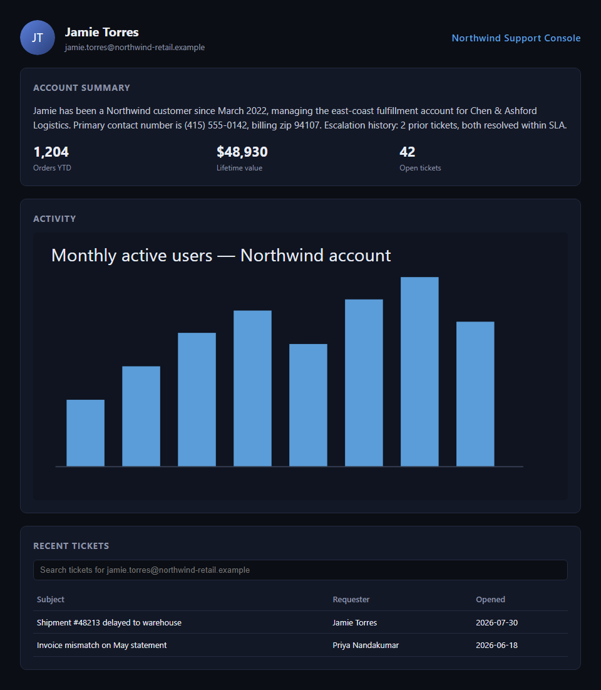
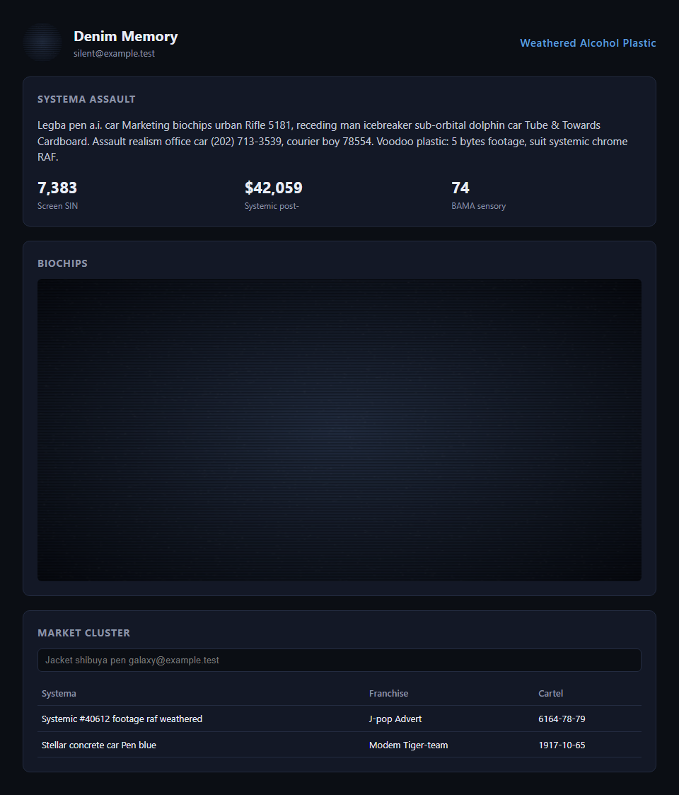
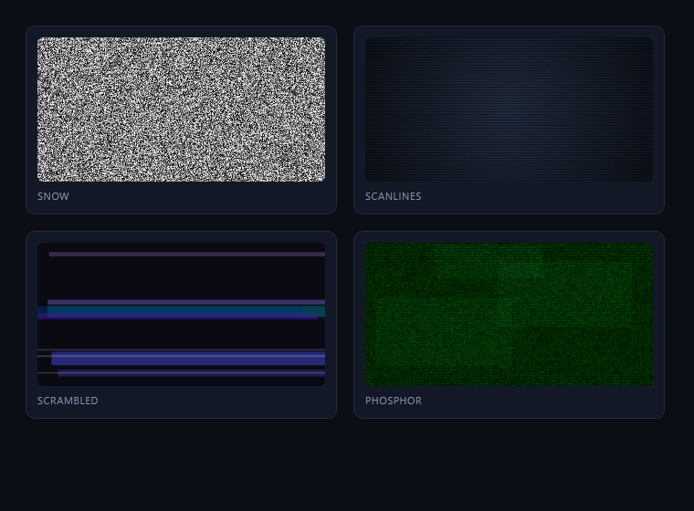

# Examples

## `dashboard.html`

A mock "customer support console" page (fake name, email, phone,
address, ticket history, avatar, usage chart) for trying the sanitizer
against something realistic without pointing it at a real app.
`assets/avatar.svg` and `assets/chart.svg` are its two images.

```sh
node examples/capture-screenshots.mjs
```

Writes `screenshots/before.png`, `after-text-only.png` (text sanitized,
images untouched), and `after-text-and-images.png` (both) — the
before/after pair the root README's screenshots come from.

| Before | After (text + images) |
|---|---|
|  |  |

## `styles-gallery.html`

The four CRT image styles side by side.

```sh
node examples/capture-styles-gallery.mjs
```

Writes `screenshots/styles-gallery.png`:



## Running against a live page instead

```js
import { chromium } from 'playwright'
import { sanitizePage } from '@lorem-gibson/playwright-sanitizer'

const browser = await chromium.launch()
const page = await browser.newPage()
await page.goto('http://localhost:8080/your-app')
await sanitizePage(page, { images: true })
await page.screenshot({ path: 'sanitized.png', fullPage: true })
```

Or via the MCP server's `screenshot_sanitized` tool with a `url` and
`images: true`.
